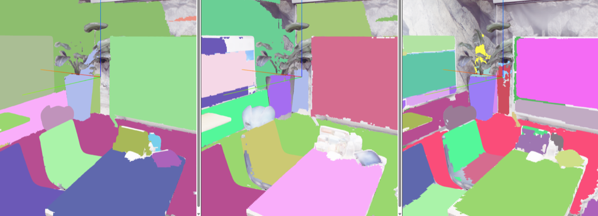
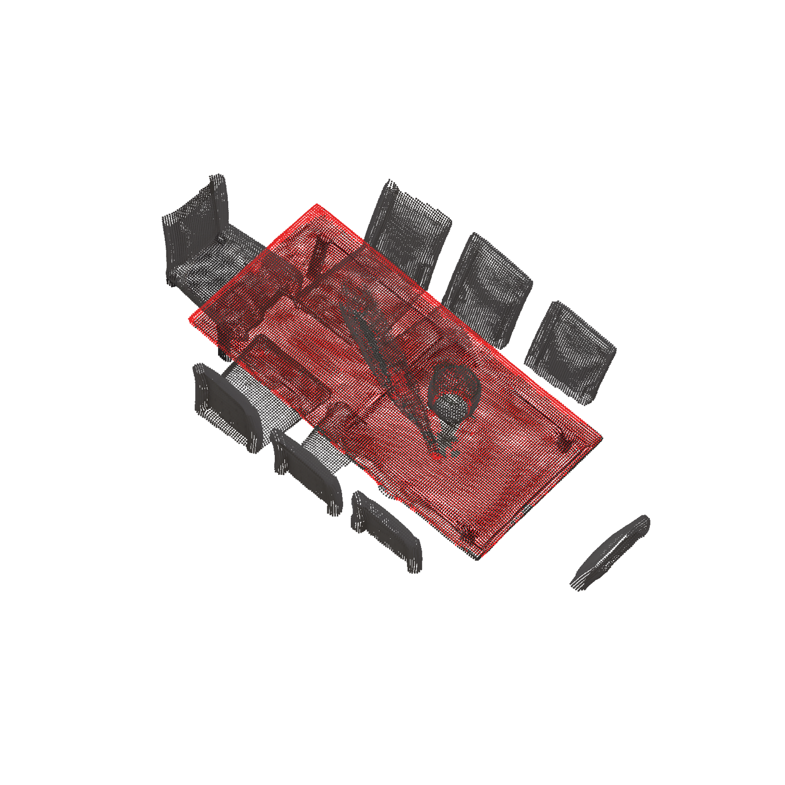
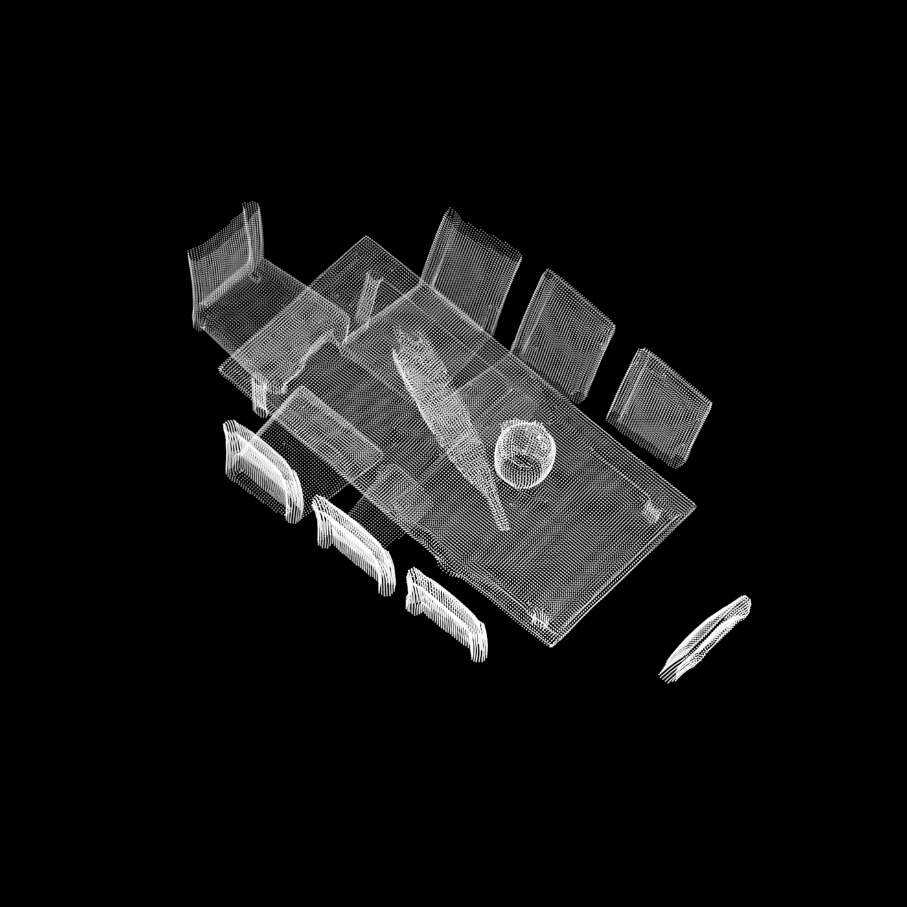

# Can a Vision-Language Model Improve the Grouping of 2D Masks into 3D Object Instances?

Samet Degirmenci, Florian Wissel, Kateřina Skotnicová, Omar Bin Faheem
Machine Learning for 3D Geometry (SS 2026), Technical University of Munich

**[Paper](docs/paper.pdf)** · **[Poster](docs/poster.pdf)**

Bottom-up 3D instance segmentation groups per-frame 2D masks into 3D objects.
[MaskClustering](https://github.com/PKU-EPIC/MaskClustering) does this purely geometrically, from multi-view
*view consensus*, which is cheap and surprisingly strong but semantically blind: it under-merges objects seen in
too few frames and over-merges spatially co-located ones, because it has no notion of what an object is.

**Research question: can semantic evidence from a vision-language model improve geometric mask grouping,
without an expensive pairwise VLM call for every candidate pair?**

We compare five edge scorers under an identical CropFormer mask backbone and identical downstream clustering, so
differences are attributable to the edge score alone: the geometric baseline, zero-shot Qwen3-VL, LoRA
fine-tuned Qwen3-VL, a simple average of the two, and a learned fusion MLP over one semantic and five geometric
features.

## Results

Class-agnostic AP on held-out test scenes. Qwen was fine-tuned on `office0`, `office1`, `office2`, `room0`; the
fusion MLP used a leak-free train/val/test split, so neither model saw `room2` or `office3`.

| Edge scorer | room2 AP | AP@50 | AP@25 | office3 AP | AP@50 | AP@25 |
|---|---|---|---|---|---|---|
| View consensus (baseline, iterative) | 0.082 | 0.189 | 0.423 | **0.128** | **0.265** | **0.432** |
| Qwen zero-shot | 0.019 | 0.032 | 0.105 | 0.013 | 0.046 | 0.155 |
| Qwen fine-tuned (LoRA) | 0.010 | 0.010 | 0.091 | 0.016 | 0.056 | 0.113 |
| Average (Qwen + consensus) | 0.075 | 0.191 | 0.430 | **0.128** | **0.265** | **0.432** |
| **Fusion MLP (geo + Qwen)** | **0.083** | **0.205** | **0.441** | 0.127 | 0.262 | 0.427 |

**This is a negative result, reported as one.** The fusion MLP is the only semantic-aware variant competitive
with pure geometry, and it gets there in a *single* clustering pass against the baseline's iterative one. But
the margin is within noise. On Replica, geometry carries almost all of the usable signal.

The 2D mask backbone matters far more than the semantic signal (pooled over all 8 scenes):

| Backbone | AP | AP@50 | AP@25 |
|---|---|---|---|
| **CropFormer** | **0.123** | **0.260** | **0.472** |
| SAM3 (conf. 0.25) | 0.123 | 0.224 | 0.370 |
| SAM (ViT-H) | 0.061 | 0.107 | 0.222 |



*CropFormer (left) produces the most instance-coherent masks; SAM (middle) fragments objects into parts; SAM3
(right) is limited by its fixed text vocabulary.*

### Why LoRA fine-tuning made things worse

Fine-tuning *hurt* held-out performance relative to zero-shot on room2 (AP 0.010 vs 0.019). At the default
threshold the fine-tuned model reaches recall ≈ 0.97 at a false-positive rate ≈ 0.89: it predicts "same
instance" for nearly every pair. Because clustering takes connected components, a few bad positive edges
transitively fuse many unrelated masks into one mega-cluster, so mild per-prediction miscalibration is
catastrophic downstream.

We attribute this to the small fine-tuning set (6,572 pairs from 4 scenes, 2 epochs) rather than a limitation of
VLM-based scoring: the positive and negative score distributions after fine-tuning are barely separated (mean
0.673 vs 0.624), and raising the threshold to 0.68 partially recovers performance.

## Method

1. **Mask backbone.** Clustering quality is bounded by input mask quality, so the backbone is fixed first.
   CropFormer wins the downstream AP comparison and is used everywhere after that.
2. **Candidate-pair filtering.** Scoring every pair with a VLM is O(N²) per scene and infeasible. A deliberately
   lenient OR-rule keeps a pair if depth IoU ≥ τ, or either directional overlap ≥ τ, or view consensus ≥ τ_c
   (τ = 0.05, τ_c = 0.30), spending the VLM budget only on plausible candidates.
3. **Semantic scoring.** Each retained pair is rendered as two colored mask outlines on their RGB frames and
   Qwen3-VL is queried for P(same instance). The LoRA variant adapts the last 8 of 24 vision-encoder blocks,
   pools patch tokens with learned attention, and concatenates both image tokens into a small MLP head.
4. **Fusion MLP.** One semantic feature (p_Qwen) plus five geometric ones (view consensus, log observation
   count, depth IoU, both directional overlaps) map to a single fused edge probability, trained on Replica
   ground truth. Because it consumes a precomputed Qwen score, fusion adds no VLM cost at clustering time.

### Qualitative comparison

| Baseline | Fusion MLP |
|---|---|
|  |  |

Both correctly group the room2 dining table into one instance. Visible differences concentrate on harder,
low-observation objects, consistent with the small quantitative gap.

## Limitations

- **Single-pass clustering cannot self-correct.** One wrong "same instance" edge merges unrelated masks with no
  mechanism to recheck consistency as clusters grow, unlike MaskClustering's iterative merging. We could not
  evaluate an iterative fusion variant due to compute constraints.
- **Candidate filtering caps recall.** Discarding true positive pairs bounds achievable recall regardless of
  scorer quality.
- **Narrow evaluation.** One small synthetic dataset, one LoRA recipe. Replica's smooth, dense camera
  trajectories make the geometric baseline unusually strong, likely understating the value of semantic evidence
  on sparser real-world captures.

## Repository structure

| Milestone | Directory | Contents |
|---|---|---|
| 1 - Baseline | `Project/Milestone 1/` | MaskClustering reproduction on Replica (notebooks) |
| 2 - Mask backbone | `Project/Milestone 2/` | CropFormer vs SAM (ViT-H) vs SAM3 comparison |
| 3 - Semantic edge scorer | `Project/Milestone_3/` | Candidate-pair filtering, Qwen3-VL scoring (zero-shot and LoRA), fine-tuning code |
| 4 - Fusion | `Project/Milestone_4/` | Fusion MLP, qualitative render script |

`MaskClustering/` is the upstream baseline (graph construction, clustering, evaluation).

## Setup

Everything from CropFormer 2D masks through MaskClustering, CLIP features and evaluation runs from a single
notebook. Setup is one-time per machine.

### 1. Get a GPU

```bash
ssh <you>@ml3d.vc.in.tum.de
salloc --gpus=1
```

Requires TUM eduVPN off-campus. `salloc` gives an interactive session on a compute node (max 8h). Anything using
CUDA must run on a GPU node; the login node is CPU-only.

### 2. Clone and install

```bash
git clone https://github.com/sametd04/ML3D-VLM_based_2D_mask_grouping.git
cd ML3D-VLM_based_2D_mask_grouping
bash setup_env.sh
```

Creates the `maskclustering` conda env with PyTorch (CUDA 11.8), pytorch3d, detectron2, CropFormer (built under
`MaskClustering/third_party/`, gitignored) and `requirements.txt`. It takes a while because pytorch3d builds
from source. Safe to re-run if interrupted; it skips completed steps.

### 3. CropFormer checkpoint

The checkpoint is in a **gated** HuggingFace dataset, so each person needs their own access grant:

1. Request access at https://huggingface.co/datasets/qqlu1992/Adobe_EntitySeg and accept the terms
2. Create a token at https://huggingface.co/settings/tokens
3. Run `hf auth login` on the cluster and paste it

Model weights are runtime dependencies and are deliberately not committed. Expected layout:

```text
ML3D-VLM_based_2D_mask_grouping/
├── checkpoints/
│   ├── Mask2Former_hornet_3x_576d0b.pth      # CropFormer, ~883 MB, public
│   ├── qwen/checkpoint-822/                   # LoRA adapter + classification head
│   │   ├── adapter_config.json
│   │   └── adapter_model.safetensors
│   └── fusion_mlp/fusion_mlp_fused.pt         # state dict + feature defs + norm stats
├── MaskClustering/
├── Project/
└── docs/
```

To skip the gated checkpoint entirely, set `MASK_PREDICTOR = 'sam'` in the notebook and use pre-generated SAM
masks. The two project-trained checkpoints (Qwen adapter, fusion MLP) have no public download location; get them
from a team member or regenerate them with the Milestone 3 and 4 training code.

### 4. Replica dataset

Inside `MaskClustering/`, each scene (`office0`-`office4`, `room0`-`room2`) needs `color/`, `depth/`, `poses/`,
`intrinsics.txt` and `{scene}_mesh.ply`, with ground truth at `data/replica/ground_truth/`.

### 5. Run

```bash
conda activate maskclustering
cd MaskClustering
jupyter notebook --no-browser --ip=0.0.0.0 --port 8888
```

Tunnel in from your local machine (Cell 2 of the notebook prints the command with the real node name):

```bash
ssh -L 8888:<node>.vc.in.tum.de:8888 <you>@ml3d.vc.in.tum.de
```

Open `Project/Milestone 1/maskclustering_pipeline.ipynb` and run top to bottom: 2D mask prediction → clustering →
class-agnostic evaluation → CLIP visual and text features → semantic labels → class-aware evaluation. Each step
validates its prerequisites and names the earlier step to run if something is missing.

## Reproducing the later milestones

```bash
# Milestone 2: mask backbones
python "Project/Milestone 2/run_sam_masks.py"                    # SAM (ViT-H)
python "Project/Milestone 2/run_sam3_masks.py"                   # SAM3 (text-prompted)
python "Project/Milestone 2/convert_sam_to_maskclustering.py"
bash  "Project/Milestone 2/setup_sam3_env.sh"                    # SAM3 needs a newer PyTorch

# Milestone 3: Qwen3-VL edge scorer
python Project/Milestone_3/build_qwen_candidates.py               # candidate pairs + geometric features
python Project/Milestone_3/candidates_to_pool.py                  # candidates -> pair pool
python Project/Milestone_3/score_qwen_candidates.py               # Qwen3-VL P(same instance)

# Milestone 4: qualitative renders
python Project/Milestone_4/render_clusters.py \
    --mesh room2_mesh.ply \
    --pred baseline=path/to/baseline/room2.npz fused=path/to/fused/room2.npz \
    --out-dir renders/
```

Fine-tuning lives in `Project/Milestone_3/fine_tuning.py` and `evaluate.py`; see
[Milestone_3/README.md](Project/Milestone_3/README.md) for the two required virtual environments and
[Fine_Tuning.md](Project/Milestone_3/Fine_Tuning.md) for pair building, sampling and training design. Fusion
training and inference details are in [Milestone_4/README.md](Project/Milestone_4/README.md).

## References

- Yan et al. *MaskClustering: View Consensus based Mask Graph Clustering for Open-Vocabulary 3D Instance
  Segmentation.* CVPR 2024.
- Qi et al. *High Quality Entity Segmentation* (CropFormer). ICCV 2023.
- Kirillov et al. *Segment Anything.* ICCV 2023.
- Qwen Team. *Qwen3-VL Technical Report.* 2025.
- Straub et al. *The Replica Dataset: A Digital Replica of Indoor Spaces.* 2019.
